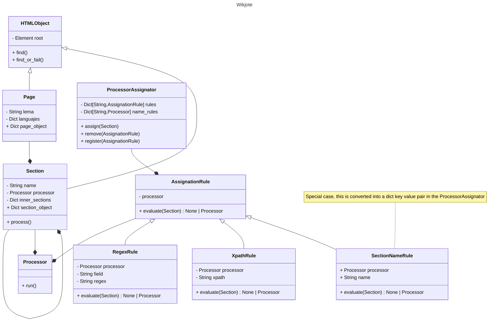

<h1 align="center">Wikjote code summary</h1>

This document provides a summary explanation of how the Wikjote package works. The purpose is to provide new users with the capabilities of understanding, modifying and extending the package.

Since Wikjote works with zim files the html is not the same as the original sites, check the zim of your site in the [Kiwix Library](https://library.kiwix.org/).

## Wiktionary conversion to JSON

To convert an HTML document into JSON Wikjote, divide the documents into a set of classes that will later extract and structure your information.

This set of classes is made up of a main class that represents the **Page**, this **Page** will contain a list of **Sections**, each one will have a **name**, **type**, **content** and also another list of **Sections**, their **subsections**.

Each **Section** is associated with a **Processor**, a class that provides a `run()` method that is responsible for analyzing the html and extracting the important content. These processors should focus on converting the html to json, content modifications and corrections should be minimized, the postporcessing phase will take care of it.

The association between a **Section** and a **Processor** is made by the **ProcessorAssignator** a class that contains a set of **AssignationRules**. When a **Section** is provided to the **ProcessorAssignator** it will go through all its rules in search of one that is correctly fulfilled, once found, it will create the **Processor** that indicates said rule and associate it with the **Section**.

There are currently three types of rules:

 - NameRule: Check that the name of the section is the one that contains the rule.
 - RegExRule: Check if any match is found with searching for a regular expression in an attribute in the section.
 - XpathRule: Check if any match is found with xpath search in the html in the section.

The rules are registered in the **ProcessorAsignator** in the `register_rules()` method of `main.py` using the rules specified in the config file.

## Wikjote UML:

