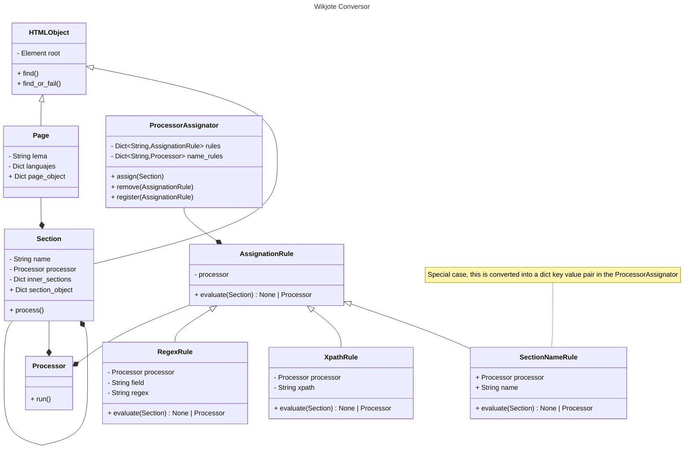

```mermaid
---
title: Wikjote Conversor
---

classDiagram

    class HTMLObject{
        - Element root

        + find()
        + find_or_fail()
    }

    class Page{
        - String lema
        - Dict languajes
        + Dict page_object

    }

    class Section{
        - String name
        - Processor processor
        - Dict inner_sections
        + Dict section_object

        + process()
    }

    class Processor{
        + run()
    }

    class ProcessorAssignator{
        - Dict~String,AssignationRule~ rules
        - Dict~String,Processor~ name_rules
        
        + assign(Section)
        + remove(AssignationRule)
        + register(AssignationRule)
    }

    class AssignationRule{
        - processor

        + evaluate(Section) None | Processor
    }

    class RegexRule{
        - Processor processor
        - String field
        - String regex

        + evaluate(Section) None | Processor
    }

    class XpathRule{
        - Processor processor
        - String xpath

        + evaluate(Section) None | Processor
    }

    note for SectionNameRule "Special case, this is converted into a dict key value pair in the ProcessorAssignator" 
    class SectionNameRule{
        + Processor processor
        + String name

        + evaluate(Section) None | Processor
    }


    HTMLObject <|-- Page
    HTMLObject <|-- Section

    Section --* Section

    Page --* Section
    Section --* Processor

    ProcessorAssignator --* AssignationRule
    AssignationRule --* Processor

    AssignationRule <|-- RegexRule
    AssignationRule <|-- XpathRule
    AssignationRule <|-- SectionNameRule

```