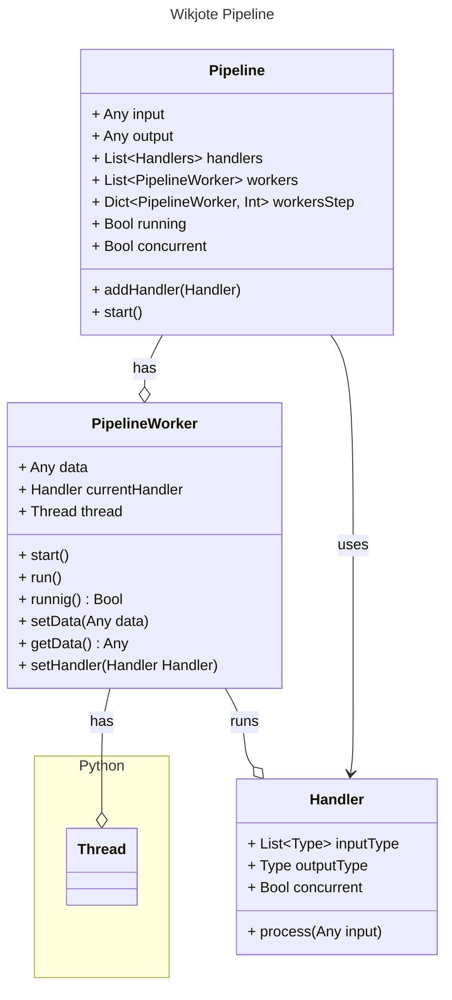

```mermaid
---
title: Wikjote Pipeline
---

classDiagram

    class Pipeline {
        + Any input
        + Any output
        + List~Handlers~ handlers
        + List~PipelineWorker~ workers
        + Dict~PipelineWorker, Int~ workersStep
        + Bool running
        + Bool concurrent

        + addHandler(Handler)
        + start()

    }

    class Handler {
        + List~Type~ inputType
        + Type outputType
        + Bool concurrent

        + process(Any input)
    }

    class PipelineWorker {
        + Any data
        + Handler currentHandler
        + Thread thread

        + start()
        + run()
        + runnig() Bool
        + setData(Any data)
        + getData() Any
        + setHandler(Handler Handler)
    }

    namespace Python {
        class Thread { }
    }


    Pipeline --o PipelineWorker : has
    Pipeline --> Handler : uses

    PipelineWorker --o Handler : runs

    PipelineWorker --o Thread : has

```