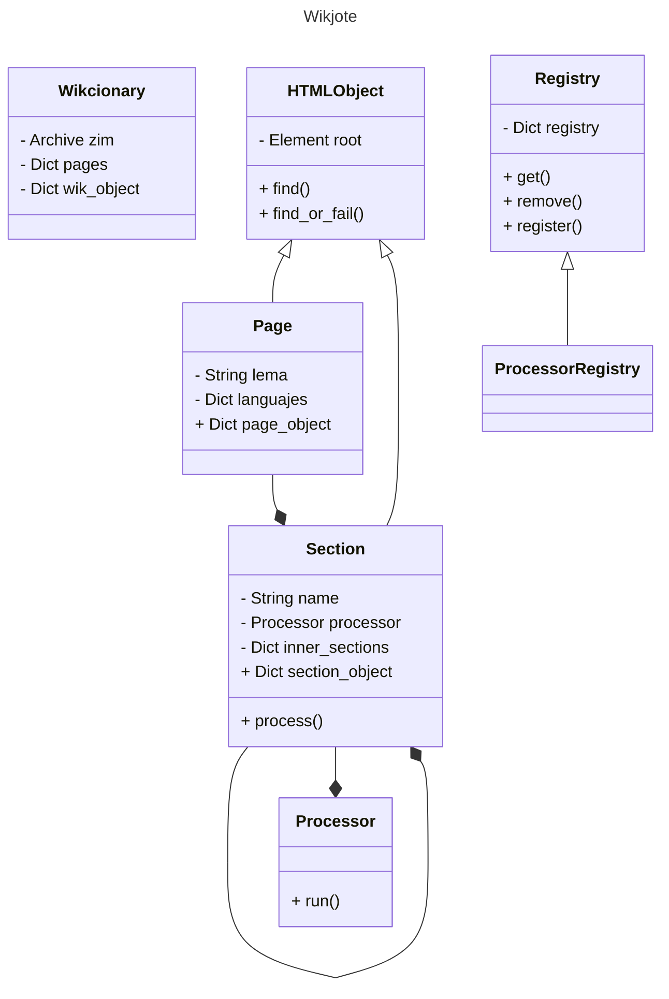

```mermaid
---
title: Wikjote
---

classDiagram
    
    class Wikcionary{
        - Archive zim
        - Dict pages
        - Dict wik_object
    }

    class HTMLObject{
        - Element root

        + find()
        + find_or_fail()
    }

    class Page{
        - String lema
        - Dict languajes
        + Dict page_object

    }

    class Section{
        - String name
        - Processor processor
        - Dict inner_sections
        + Dict section_object

        + process()
    }

    class Processor{
        + run()
    }

    class Registry{
        - Dict registry
        
        + get()
        + remove()
        + register()
    }

    class ProcessorRegistry


    HTMLObject <|-- Page
    HTMLObject <|-- Section

    Section --* Section


    Registry  <|-- ProcessorRegistry

    Page --* Section
    Section --* Processor

```